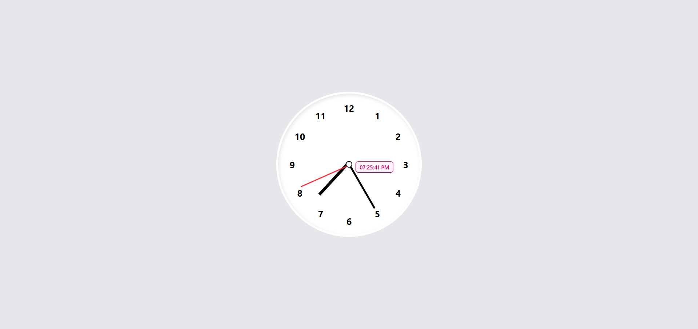

# 🕒 Digital & Analog Clock - React App

A stylish and functional **Digital & Analog Clock** built using **React.js**. This project displays the current time in both digital and analog formats and updates live every second.

---

## ✨ Features

- ⏰ **Digital Clock** - Shows time in HH:MM:SS format
- 🕰️ **Analog Clock** - Functional clock with rotating hands
- 🔄 **Real-Time Updates** - Syncs with your system time every second
- 💡 **React Hooks** - Uses `useState` and `useEffect`
- 📱 **Responsive Design** - Works across desktop and mobile screens
- 🎨 **Clean UI** - Minimalistic and modern design

---

## 🖼️ Preview

---

## 🚀 Getting Started

### Prerequisites

- [Node.js](https://nodejs.org/)
- [npm](https://www.npmjs.com/) or [yarn](https://yarnpkg.com/)

